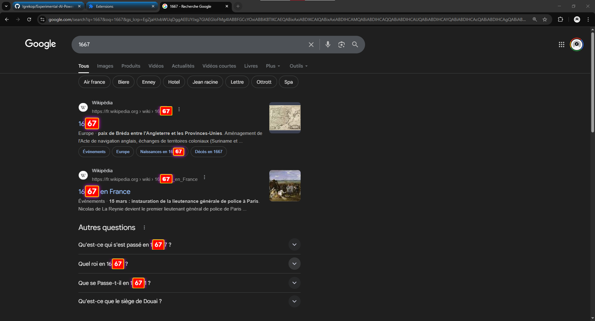

  
  <h1>67 Meme Detector Extension</h1>
  
<strong>What is this Diddy blud doing on his calculator is blud Einsten?</strong>

 

## 📖 Overview

The **67 Meme Detector** is a chaotic Chrome/Chromium browser extension. It constantly scans the web pages you visit in real-time, looking for any mention of the legendary number **"67"** (including variants like "six sept", "6-7", "⁶⁷", etc.). 

When the sacred number is detected, the extension triggers a **2-second completely unhinged psychedelic mode** — the screen shakes violently, colors flash everywhere, the number gets highlighted, and **dozens of spinning 3D models rain across the screen** in pure chaos.

  
  

## ✨ Features

- 🔍 **Real-Time Scanning:** Automatically detects "67" and its variations in any text node on the page as you browse.
- 🎨 **Psychedelic Chaos Mode:** Triggers a 2-second screen shake and flashing rainbow background whenever a "67" is spotted.
- 🧊 **3D Model Explosion:** Spawns **15-25 copies** of a spinning 3D model (`67.glb`) at random positions, random sizes, and random rotation axes using **Three.js** + WebGL.
- 🖍️ **Text Highlighting:** Visually isolates the exact text that triggered the meme with a glowing red highlight.
- 👀 **Dynamic Content Support:** Constantly watches the DOM to catch newly loaded content (infinite scroll friendly!).

## 🏗️ Technical Stack

| File | Role |
|---|---|
| `three.min.js` | Three.js r128 (UMD) — 3D rendering engine |
| `GLTFLoader.js` | Loads `.glb` 3D model files |
| `content.js` | Main script: detection, CSS animations, 3D scene |
| `67.glb` | 3D model displayed during chaos mode |
| `manifest.json` | Chrome Extension Manifest V3 config |

## ⚙️ Installation & Setup

Since this is an unpacked extension, you'll need to install it manually in developer mode:

1. **Download/Clone the Repository:** 
   Clone this repo or download the ZIP and extract it to a folder on your computer.
2. **Open Extensions Page:** 
   In your Chromium-based browser (Chrome, Edge, Brave), navigate to `chrome://extensions/` (or `edge://extensions/`).
3. **Enable Developer Mode:** 
   Toggle the "Developer mode" switch in the top right corner.
4. **Load Unpacked:** 
   Click the **"Load unpacked"** button in the top left.
5. **Select the Folder:** 
   Choose the downloaded directory containing the `manifest.json` file.
6. **Enjoy the Chaos:** 
   Visit any website, find or type "67" to witness the madness!

## 📜 License

Created for the culture. Do whatever you want with it! 🏎️💨
